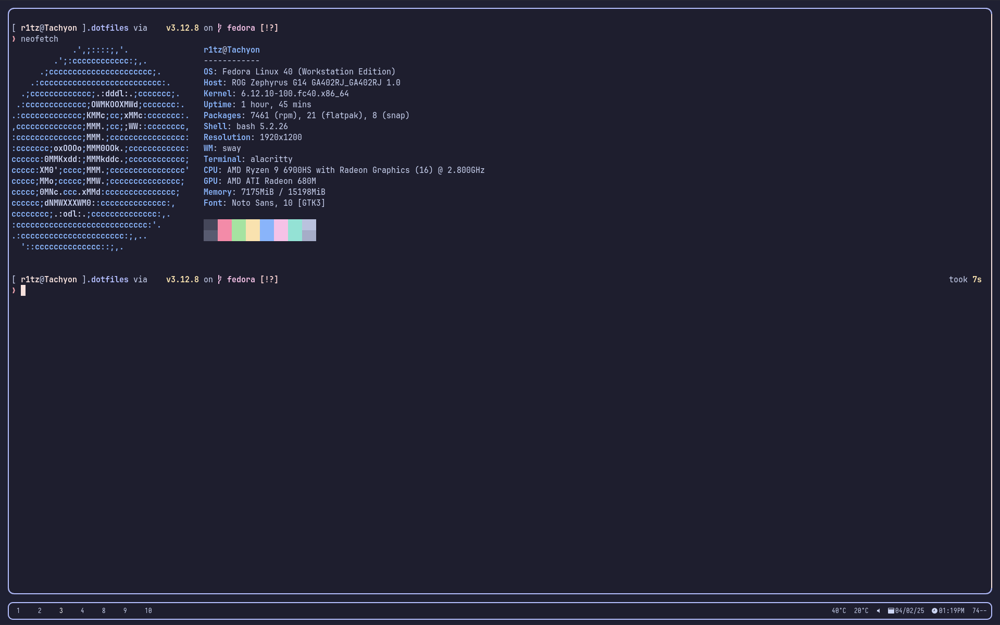

## My Dotfiles for Fedora
While Ubuntu has generally been my go-to Linux distro for a while now, Fedora just has better support for my current machine. Fedora on the G14 runs surprisingly well, and I thought it was about time to swap my Ubuntu dual boot to Fedora.

*Do not use the `install.py` script!*

