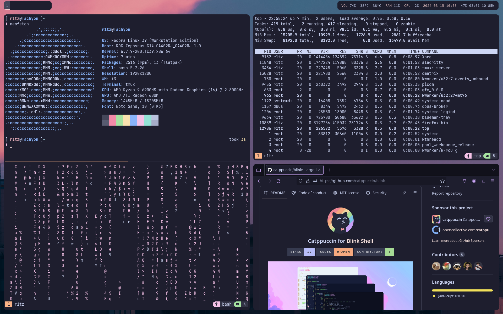

## My Dotfiles for Fedora
While Ubuntu has generally been my go-to Linux distro for a while now, Fedora just has better support for my current machine. Fedora on the G14 runs surprisingly well, and I thought it was about time to swap my Ubuntu dual boot to Fedora.

## Prerequisites
- Python3 is installed.
- rustup is installed.
- A C compiler is installed.

After cloning the repo, navigate to the root of the repo and run `python3 install.py`. This will install and setup:
- Neovim (0.9.0) -> LazyVim
- Tmux (3.2a)
- Starship

Note that this will uninstall any existing installation of Neovim to avoiding conflicting with [bob](https://github.com/MordechaiHadad/bob) (my preferred choice of Neovim management).

The install script is supposed to be idempotent.

### Current Setup
- Everything is using Catppuccin Mocha.
- I don't know who made the wallpaper. If you know, let me know.

